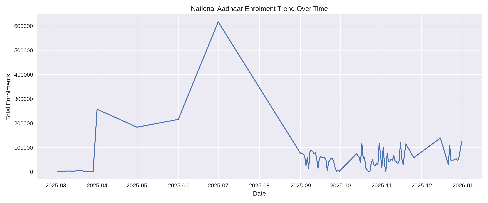
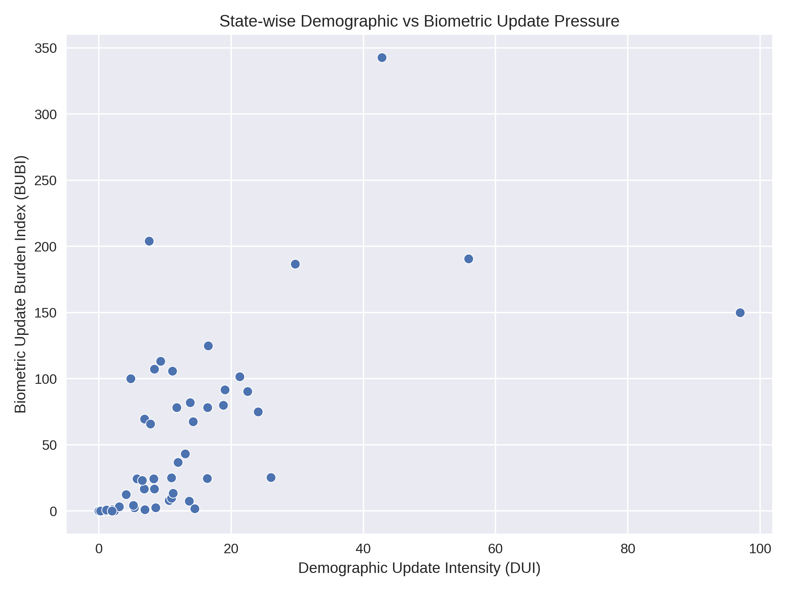
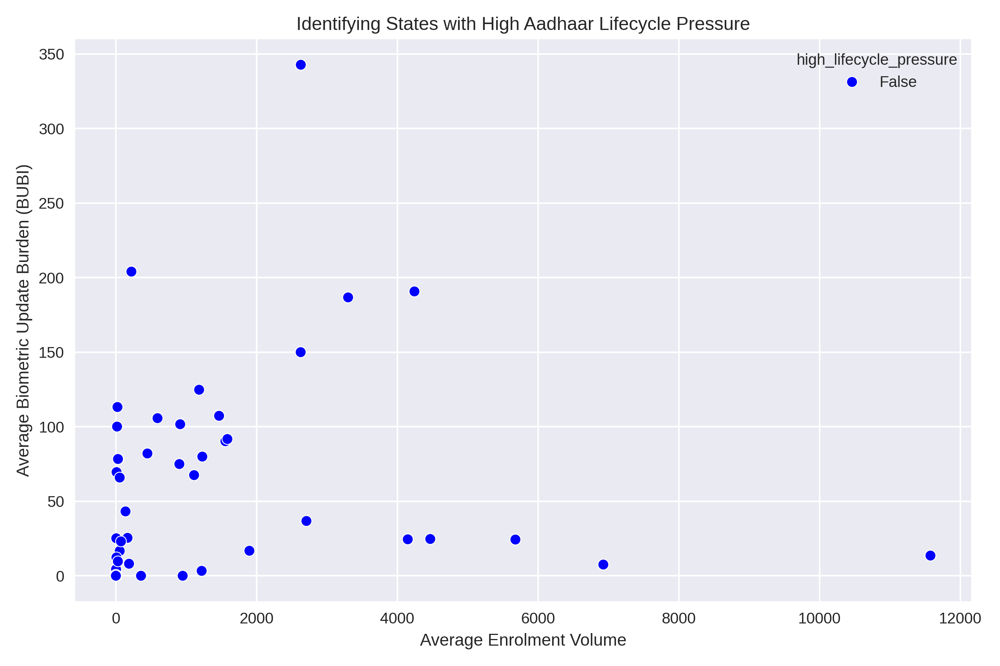
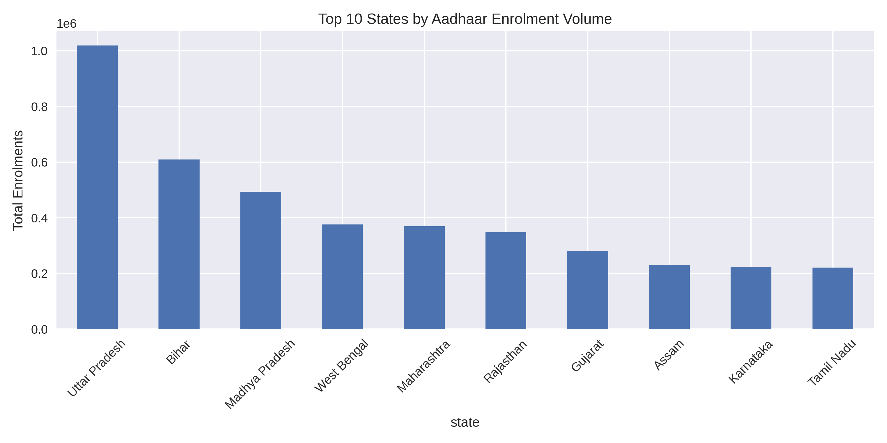
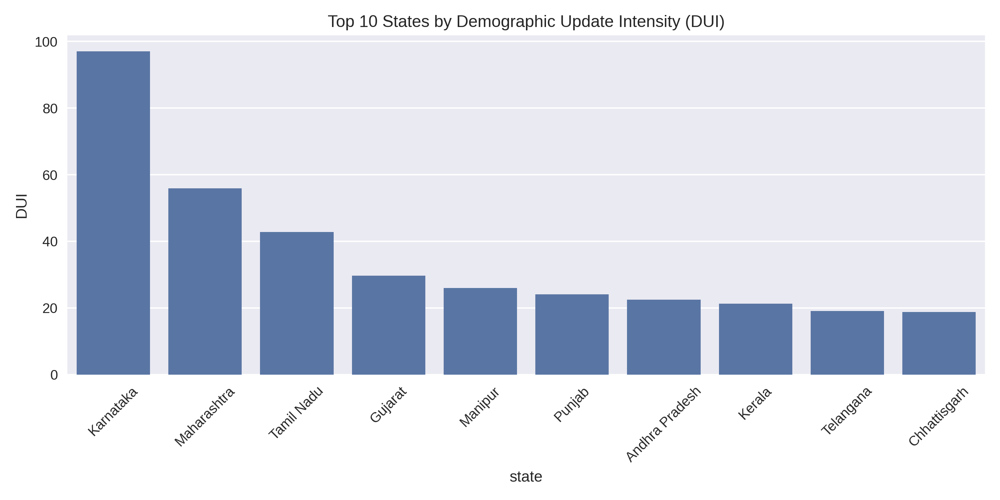
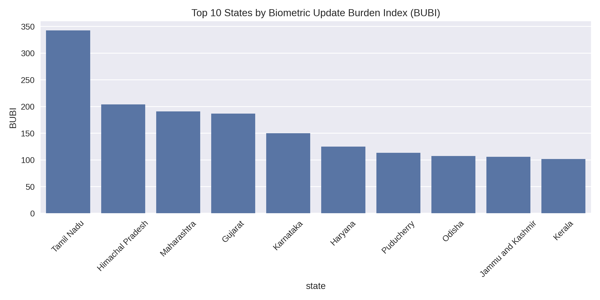
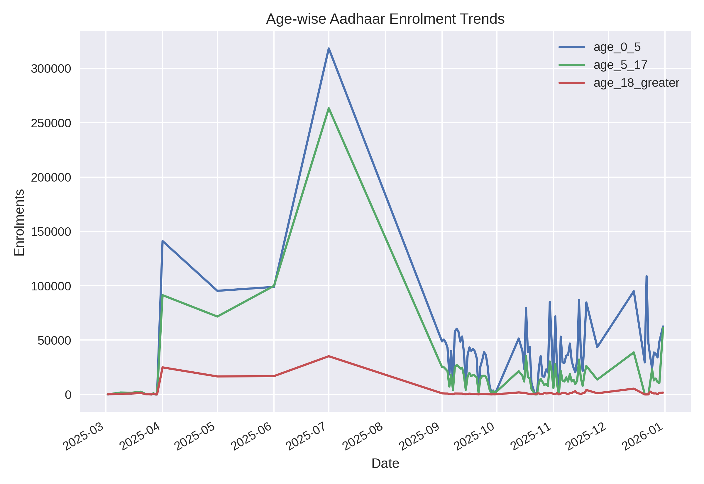

# 📊 Aadhaar Lifecycle Analytics Dashboard

A Streamlit-powered interactive dashboard for exploring Aadhaar lifecycle metrics (DUI & BUBI) by state, built for the UIDAI Data Hackathon 2026.



## 🎯 Features

- **State-level Analytics**: Filter and analyze data by state with date range controls
- **Key Performance Indicators (KPIs)**: 
  - Average Enrolment
  - DUI (Demographic Update Intensity)
  - BUBI (Biometric Update Burden Index)
  - Total Updates tracking
- **Interactive Visualizations**:
  - Enrolment and updates trends over time
  - DUI/BUBI ratio analysis with national benchmarks
  - National comparison scatter plot
- **Metrics Details**: Computed values and formulas explained
- **Data Export**: Download filtered CSV for further analysis

## 📋 Prerequisites

- Python 3.9+
- Dataset: `data/processed/lifecycle_aggregated.csv`
  - Required columns: `date`, `state`, `district`, `pincode`, `total_enrolment`, `demographic_updates`, `biometric_updates`, `DUI`, `BUBI`

## 🚀 Quick Start

### 1. Clone the repository
```bash
git clone https://github.com/ashutosh8021/uidai-lifecycle-dashboard.git
cd uidai-lifecycle-dashboard
```

### 2. Set up virtual environment
```powershell
# Windows PowerShell
python -m venv .venv
.\.venv\Scripts\Activate.ps1
```

```bash
# Linux/Mac
python -m venv .venv
source .venv/bin/activate
```

### 3. Install dependencies
```bash
python -m pip install --upgrade pip
python -m pip install -r requirements.txt
```

### 4. Run the dashboard
```bash
streamlit run app.py
```

The dashboard will open in your browser at `http://localhost:8501`

## � Dashboard Preview

### State-Level Analytics
Analyze Aadhaar lifecycle metrics for any state with interactive filters and date range selection.



### National Comparison
Compare lifecycle pressure across all states using interactive scatter plots.



### Top 10 States by Metrics

**Top States by Enrolment:**


**Top States by DUI:**


**Top States by BUBI:**


### Age-wise Trends


## �📊 Metrics Explained

### DUI (Demographic Update Intensity)
```
DUI = demographic_updates ÷ total_enrolment
```
Measures the ratio of demographic updates to total enrolments.

### BUBI (Biometric Update Burden Index)
```
BUBI = biometric_updates ÷ total_enrolment
```
Quantifies the burden of biometric updates relative to enrolments.

## 📁 Project Structure

```
uidai-lifecycle-dashboard/
├── app.py                          # Main Streamlit application
├── requirements.txt                # Python dependencies
├── README.md                       # This file
├── .gitignore                      # Git ignore rules
└── data/
    └── processed/
        └── lifecycle_aggregated.csv  # Dataset
```

## 🛠️ Technologies

- **Streamlit** - Web framework
- **Pandas** - Data manipulation
- **Plotly** - Interactive visualizations
- **NumPy** - Numerical computing

## 📝 Notes

- State names are automatically normalized to handle inconsistent formatting
- National benchmarks are computed from the full dataset
- The app caches data and computation for better performance

## 🤝 Contributing

This project was developed for the UIDAI Data Hackathon 2026. Feel free to fork and enhance!

## 📄 License

MIT License - see LICENSE file for details

---

**Built with ❤️ for UIDAI Data Hackathon 2026**
